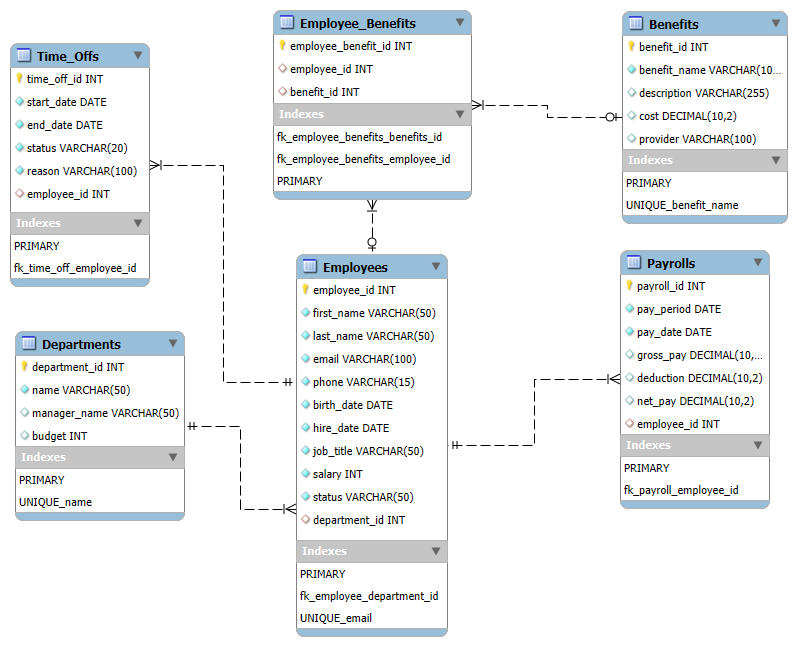

# Employee Management Database

## Overview:
A mid-sized company has more than 200 employees across five departments. Over the years, managing employee information, departmental structures, payroll records, and benefits enrollment has become increasingly difficult. This Employee Management System will store and manage data for core entities including:
Employees: personal info, job titles, department assignments

**Departments**: leadership and budget information

**Time-Off**: PTO balances, requests, approvals

**Payroll**: pay schedules, deductions, and payment history

**Benefits**: enrollments in health, dental, and retirement plans

The system will help HR and management efficiently monitor employee data within minutes, manage departmental hierarchies, approve and track time-off requests, process payrolls accurately, and track benefits enrollments. This will include the tracking of over 1,000 time-off requests/approvals, a handful of benefits information for all 200+ employees, up to 20,000 payroll transactions before a backup is required, and employee personal info for 5,000 people (if needed).

## Database Outline:
**Employees:** records the information of employees working for the company

employee_id: int, auto_increment, unique, not NULL, PK  
first_name: varchar, not NULL   
last_name: varchar, not NULL  
email: varchar, unique, not NULL  
phone: varchar, not NULL  
birth_date: date, not NULL  
hire_date: date, not NULL  
job_title: varchar, not NULL  
salary: int, not NULL  
status: varchar, not NULL  
department_id: FK referencing Departments

**Relationship #1:** a M:1 relationship between Employees and Departments is implemented with department_id as a FK inside of Employees.  
**Relationship #2:** a 1:M relationship between Employees and Time_Offs is implemented with employee_id as a FK inside of Time_Offs.  
**Relationship #3:** a 1:M relationship between Employees and Payrolls is implemented with employee_id as a FK inside of Payrolls.  
**Relationship #4:** a M:N relationship between Employees and Benefits is implemented with an intersection table (Employee_Benefits) that includes employee_id and benefit_id as FK’s.  

**Departments:** records the names and heads of different departments  
department_id: int, auto_increment, unique, not NULL, PK  
name: varchar, not NULL, unique  
manager_name: varchar  
budget: int

**Relationship #1:** a 1:M relationship between Departments and Employees is implemented with department_id as a FK inside of Employees.

**Time_Offs:** records scheduled duration and reason of time-off for employees  
time_off_id: int, auto_increment, unique, not NULL, PK  
start_date: date, not NULL  
end_date: date, not NULL  
status: varchar, not NULL, constrained only to accept ‘Pending’, ‘Approved’, ‘Denied’  
reason: varchar, not NULL  
employee_id: FK referencing Employees

**Relationship:** a M:1 relationship between Time_Offs and Employee is implemented with employee_id as a FK inside of Time_Offs.

**Payrolls:** records the pay information for each employee (i.e. pay period, amount, deductions, etc.)  
payroll_id: int, auto_increment, unique, not NULL, PK  
pay_period: date, not NULL  
pay_date: date, not NULL, (date payment issued)  
gross_pay: decimal(10, 2), (total before deduction)  
deduction: decimal(10, 2), (taxes, insurance, retirement)  
net_pay: decimal(10, 2), (gross - deductions)
employee_id: FK referencing Employees

**Relationship:** a M:1 relationship between Payrolls and Employees is implemented with employee_id as a FK inside of Payrolls.

**Benefits:** records benefits and description of it  
benefit_id: int, auto_increment, unique, not NULL, PK  
benefit_name: varchar, not NULL  
description: varchar  
cost: decimal(10, 2)  
provider: varchar, (Blue Cross, Fidelity, etc.)

**Employee Benefits:** a M:N relationship between Benefits and Employees is implemented with an intersection table (Employee_benefits) that includes employee_id and benefit_id as FK’s.  
Employee_Benefits: intersection table for an M:N relationship  
employee_benefits_id: int, auto_increment, unique, not NULL, PK  
employee_id: int, FK referencing Employees  
benefit_id: int, FK referencing Benefits  

**Relationship:** serves as the intersection table connecting the M:N relationship between Employees and Benefits.

## Schema:

**Citations:**
For Handlebar files- Used ChatGPT to help with formatting and the update form that each page contains.
For styles.css file- Used ChatGPT to assist making the overall style more user-friendly.
For app.js- Used ChatGPT to help add proper date formatting and handlebar
helper funcs and to implement the new stored procs from pl.sql.
Also, used it for guidance on how to group M:N entities together
Ex #1: Given the following date [paste date], how could I
go about making it the format January 1, 2000
Ex #2: Given the M:N relationship between Employees and
Benefits, how would I go about grouping them so they benefits
are with the correct employee

For general setup- Used Activity 2 from the Week 1 module to setup the Node backend server.